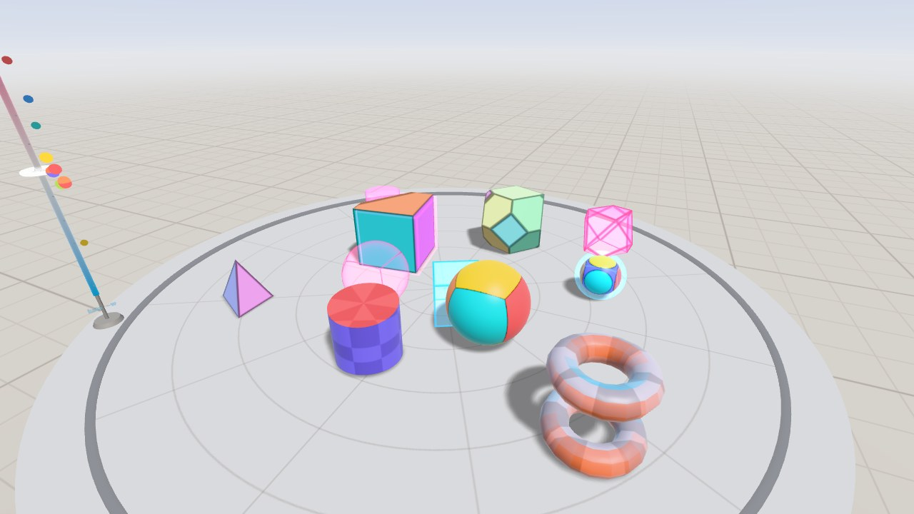
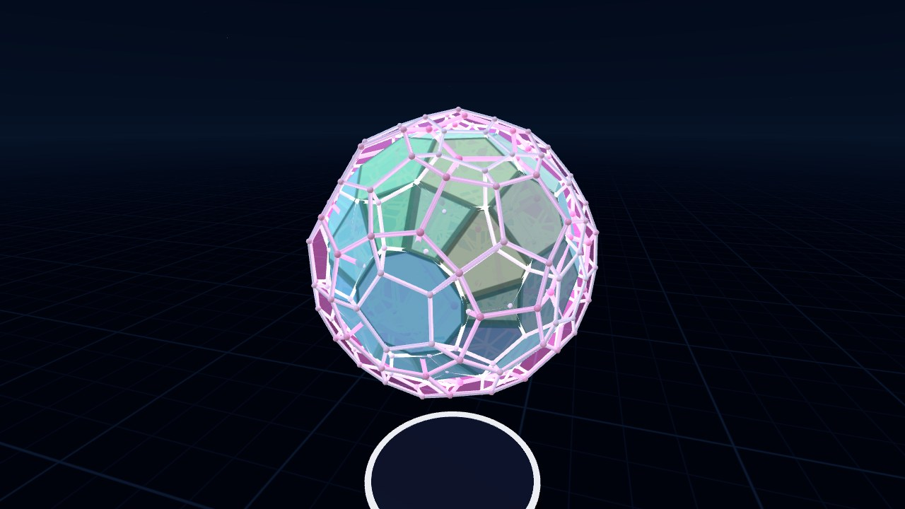
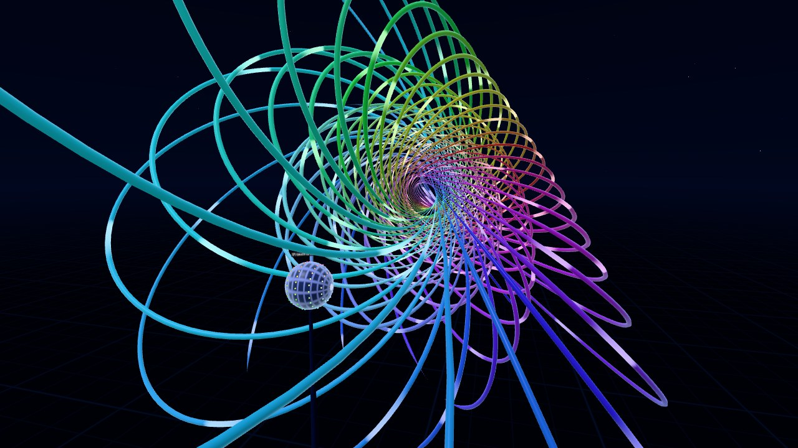
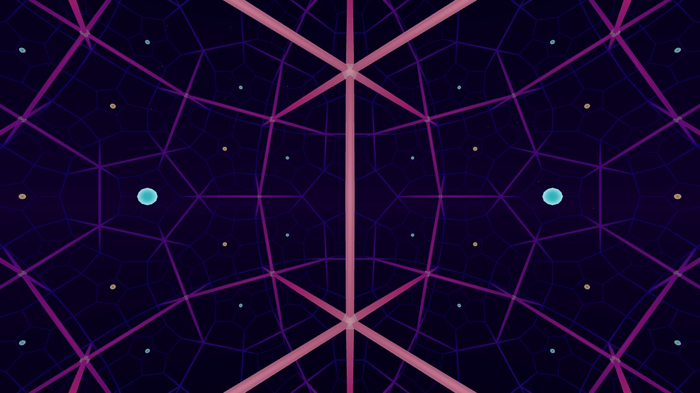
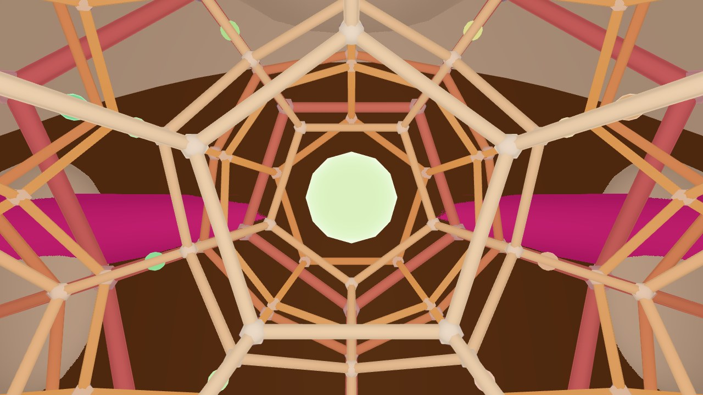
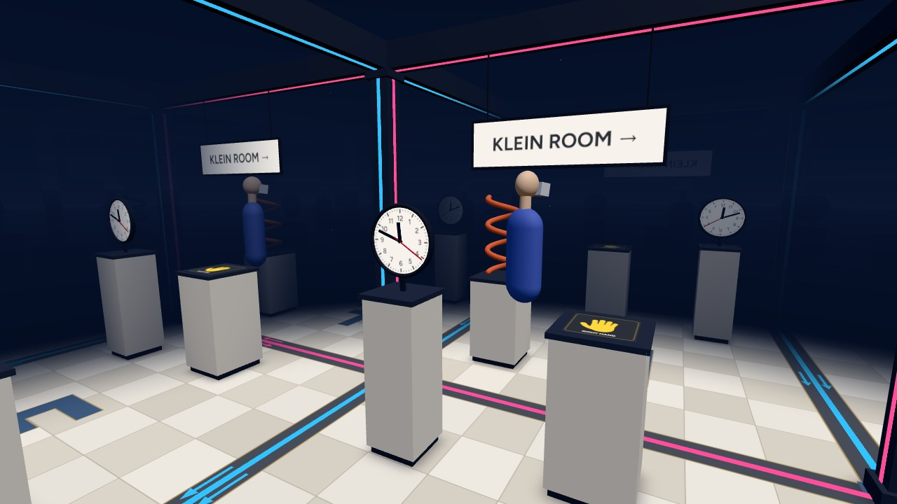

# 4D VR

<table>
  <tr>
    <td width="50%"><br><b>Hyperplay</b>: 4D physics sandbox, sliced to 3D</td>
    <td width="50%"><br><b>Polytope Lab</b>: the 120-cell, projected</td>
  </tr>
  <tr>
    <td><br><b>Hopf Garden</b>: fibers of the Hopf fibration</td>
    <td><br><b>Hyperbolic Space</b>: the {5,3,4} honeycomb from inside</td>
  </tr>
  <tr>
    <td><br><b>Spherical Space</b>: the 120-cell tiling of S³, with the back of your own head in the distance</td>
    <td><br><b>Klein Room</b>: a room glued to itself with a flip</td>
  </tr>
</table>

This is a WebXR app for viewing and interacting with 4D objects and non-Euclidean space. It's built with [Three.js](https://threejs.org/) for the Meta Quest with hand tracking. Controllers work too, and every scene runs in a desktop browser with a mouse and keyboard.

Visit the [GitHub Pages site](https://4dvr.jarvisar.com/) to access the latest deployment.

## Scenes

- **Hyperplay:** A 4D physics sandbox on a table with the regular 4-polytopes, hyperspheres, duocylinders, spherinders, cubinders, and a tiger. Objects are shown as 3D cross-sections. The slice can be moved along w or rotated in the xw/zw planes. The sun can lean toward ana (+w), so objects outside the slice still cast shadows into it. Presets:
  - Sandbox, Tower, Hyperballs, Rollers, and Polytopes: sets of objects to play with.
  - Sealed box: get the ball out of a closed glass box by moving it through w.
  - Mirror: fit a chiral piece into an outline of its mirror image. Only a half-turn through w does it.
  - Dice: the regular 4-polytopes as a d5, d8, d16, d24, d120, and d600.
  - Orbits: moons around a sun with 4D gravity (1/r³). There are no stable orbits, so a small nudge sends a moon into the sun or off for good. Can be switched to 1/r² to compare.
  - Shadows: the sun leans 50° toward ana.
  - Worldline: a motion with time as the w axis, so moving the slice replays it. Shows juggling by default and can record 4 seconds of your hands, controllers, or mouse.
- **Polytope Lab:** The regular 4-polytopes as perspective or stereographic projections, with the current cross-section drawn inside. Also has a tesseract net that folds up, and cross-sections of curved shapes like the spheritorus.
- **Knot Lab:** A rope simulated in 4D. Strands only collide when they're close in all four coordinates, so moving a strand in w lets it pass through another one. Detects when a knot is untied or a link is separated.
- **Hopf Garden:** The Hopf fibration of the 3-sphere. Touch the globe to add the fiber for that point.
- **Hyperbolic Space:** The {5,3,4} and {4,3,5} honeycombs viewed from inside. Head movement is tracked in hyperbolic space, so walking in a loop leaves you slightly rotated.
- **Spherical Space:** The 120-cell, 24-cell, tesseract, and 5-cell as tilings of the 3-sphere, viewed from inside. Walking straight for 2π times the radius brings you back to the start, and straight ahead at the end of the long way round is the back of your own head.
- **Klein Room:** A room glued to itself. Walk out the left or right side and you come back in the other. Walk out the front or back and you come back mirror-reversed. After crossing a flipped wall, text reads backward and your left hand fits the right-hand print.
- **Quasicrystals:** A Penrose tiling as a 2D slice of the 5D cubic lattice, and a 3D tiling as a slice of the 6D lattice. Moving the slice through the hidden dimensions rearranges tiles, but the pattern never repeats.

## Controls

The first time Hyperplay opens in VR, a short tutorial goes through grabbing, moving the slice, rotating through 4D, and opening the menu. A see-through hand shows the gestures, the fingers to use light up on your own hands, and each step moves on once you've done it. `How to play` in the menu's settings runs it again.

The controls below are for Hyperplay. The other scenes use the same grabs and gestures for their own things, and each scene's page in the menu says what they do there.

### Hand Tracking

Pinch with your thumb and index finger, or close your hand around an object, to grab, move, and throw it. Pinch with your middle finger and move your hand to rotate an object through 4D. To grab something out of reach, point at it with your arm out and pinch. It flies to your hand.

Pinch empty space and move up or down to move the slice along w. Middle-finger pinch empty space and move sideways to rotate the slice. A pinch that just missed an object doesn't move the slice.

Turn a palm toward your face and a `Menu` button shows up next to it. Tap it with your other index finger. The menu opens in front of you and stays there until you close it. Pinch the bar under it to move it. Point and pinch to use UI that's out of reach.

Don't pinch with your palm facing you. The Quest uses that gesture for its own menu (on the left hand it can end the VR session), so the app ignores those pinches.

###### Note: if only one hand is tracked, holding your palm up for 1.5 seconds opens the menu too

In Hyperbolic Space, Spherical Space, and the Klein Room, walk or pinch empty space and pull to move around.

### Controllers

Use the trigger or grip to grab, move, and throw objects. Hold both to rotate an object through 4D. Push either stick up or down to move the slice along w, or left and right to rotate it. Press `A` or `X` to open or close the menu.

In the curved spaces and the Klein Room, the left stick moves and the right stick turns, in 30° steps or smoothly. With `No turning`, both sticks move. With only one controller, its stick moves you forward and back and turns you left and right.

###### Note: the comfort vignette, turning, and larger menus are in the VR menu's settings. `Recenter` there moves the scene in front of you and fits it to your height, for example after sitting down.

Inputs with no buttons to read, like a phone viewer's screen tap or Vision Pro's look and pinch, act as a pinch, and a `Menu` button waits low in front of you instead of next to your palm. I haven't been able to test this on those devices.

### Desktop

Left drag to grab, move, and throw objects. Right drag to rotate them through 4D, or right drag empty space to rotate the slice. `Shift` and drag works the same as right drag, for trackpads. Use the scroll wheel or `Q`/`E` to move the slice along w, `A`/`D` to rotate it, and `0` to reset it. Press `1`-`8` to switch scenes, `M` to toggle the menu, and `H` to toggle the controls.

In the curved spaces and the Klein Room, use `WASD` or the arrow keys to move and drag to look. The left and right arrows turn, `Q`/`E` go down and up in the curved spaces, and `Shift` goes faster. Keys go by position, so on an AZERTY keyboard it's `ZQSD`.

The menu works with the keyboard too. `Tab` through it, press buttons with `Space` or `Enter`, move sliders with the arrow keys, and close it with `Escape`.

On touch screens, drag with one finger to grab things and orbit the camera. A two-finger drag does what a right drag does: it rotates things through 4D, rotates the slice, and pulls you along in the curved spaces and the Klein Room.

## Local Installation

Requires [Node.js](https://nodejs.org/) 20.19 or newer.

1. Clone the repo with `git clone https://github.com/jarvisar/anakata.git` and run `npm install`
2. Run `npm run dev` and open `http://localhost:5173`
3. To use it on a Quest, connect the headset to the same network, open `https://<pc-ip>:5173` in the Quest Browser, accept the certificate warning, and press `Enter VR`

The dev server also serves HTTPS on the same port with a self-signed certificate, since WebXR needs HTTPS on other devices. Plain http from another device redirects to https.

Other commands:

```sh
npm run build       # production build in dist/
npm run preview     # serve the production build
npm run test:smoke  # build and run the headless Chrome tests (requires Chrome)
npm run test:qa     # smoke tests plus scene, input, recovery and usability checks
npm run screenshots # build and retake the screenshots at the top of this README (requires Chrome)
```

Retake the screenshots after changing how a scene looks. `node tools/screenshots.mjs hopf klein` retakes only those from the last build.

The `about/`, `120-cell/`, `hopf-fibration/`, `klein-bottle/`, and `hyperbolic-space/` folders are plain HTML pages about the app and some of the scenes. They're mostly there so search engines have something to index besides a canvas. They use the README screenshots, and a new page needs adding to `PAGES` in `vite.config.js` and to `public/sitemap.xml`.

Pushing to `main` runs the smoke tests and deploys to GitHub Pages. Pull requests and other branches run the same tests and upload screenshots of each scene.

### URL Parameters

- `?scene=playground|gallery|knots|hopf|hyperbolic|spherical|klein|quasicrystal` sets the starting scene
- `?shape=hecatonicosachoron` sets Polytope Lab's starting shape, using the keys in [gallery.js](src/scenes/gallery.js)
- `?desktop` skips the start screen
- `?quality=low|medium|high` uses a graphics preset for this visit without saving it
- `?scale=1` sets the XR framebuffer scale directly
- `?hz=90` sets a fixed refresh rate
- `?stats` shows frame rate, CPU time, draw calls, triangles, and resolution per eye
- `?iwer` emulates a Quest 3 with [IWER](https://github.com/meta-quest/immersive-web-emulation-runtime) so VR mode can be tested on desktop. `?iwer=headless` hides the control panel.

## Implementation

### Slicing

4D objects are stored as tetrahedral meshes of their 3D boundary, the same approach 4D Toys uses. Slicing happens in the vertex shader in [sliceMaterial.js](src/four/sliceMaterial.js). Each tetrahedron is stored in a float texture and drawn as 4 vertices, and a 16-case lookup table turns it into a triangle, a quad, or nothing. Moving or rotating an object only updates two uniforms.

Hyperspheres are drawn as regular spheres with radius `sqrt(r² - d²)`, since every cross-section of a hypersphere is a sphere.

### 4D Shadows

An object's shadow is its projection onto the floor (a 3D hyperplane in 4D) along the sun's 4D direction. If the sun leans into w, objects outside the slice can cast shadows into it. [shadow4.js](src/four/shadow4.js) draws these into a 512x512 mask that the table multiplies its color by. The three.js shadow map isn't used.

### Physics

[world4.js](src/physics/world4.js) handles the 4D rigid bodies. Each body has a 4x4 rotation matrix and stores angular momentum as a bivector (6 rotation planes). Collisions test sample points on each body against the other body's signed distance function, and contacts are solved with sequential impulses. Held objects are moved by setting their velocity toward the hand so they still collide with walls.

### Curved Spaces

Hyperbolic Space and Spherical Space are based on [Non-Euclidean Virtual Reality](https://arxiv.org/abs/1702.04004) by Hart, Hawksley, Matsumoto, and Segerman. Each frame, head movement is converted to a hyperbolic translation (or a rotation of R⁴ in spherical space), separately for each eye. In spherical space every line of sight is a great circle, so everything is drawn twice, once along the short arc and once along the long one.

###### Note: this relies on each eye being rendered separately. Three.js's `WebGLRenderer` doesn't support multiview.

The Klein Room is flat, so it's just 25 instanced copies of the room and of you. Crossing a flipped wall turns the map from room coordinates to the real room into a reflection. Three.js picks the front face of a triangle per object, not per instance, so the mirrored copies need their own instanced mesh.

### Other Scenes

- Polytope Lab draws edges as instanced tubes and projects them to 3D in the vertex shader ([projection.js](src/four/projection.js))
- Hopf Garden finds each fiber's projected circle from three points ([hopf.js](src/scenes/hopf.js))
- Knot Lab uses position-based dynamics in 4D. A knot counts as untied when a projection of the loop has no crossings ([knots.js](src/scenes/knots.js))
- Quasicrystals uses de Bruijn's dual method, which is equivalent to cutting a slice through the lattice ([quasicrystal.js](src/scenes/quasicrystal.js))

## Performance

Graphics presets are in the menu and saved in the browser. The Quest 1 and 2 start on Medium and everything else starts on High.

| Preset | Resolution | Fixed foveation | Shadows |
| --- | --- | --- | --- |
| High | 100% | Off | On |
| Medium | 80% | Low | On |
| Low | 60% | High | Off |

Resolution is a fraction of the display's native resolution in VR (2064x2208 per eye on the Quest 3), or of the screen's pixel ratio on desktop. The VR resolution can't change during a session, so a new preset's resolution only applies the next time VR starts. 4x MSAA is always on.

The refresh rate starts at the highest rate the headset supports and drops a step if the scene can't keep up. Shaders are compiled before VR starts, and per-frame code avoids allocations to prevent garbage collection pauses on the headset.

## References

- Marc ten Bosch, [N-Dimensional Rigid Body Dynamics](https://marctenbosch.com/ndphysics/) (SIGGRAPH 2020)
- Hart, Hawksley, Matsumoto, and Segerman, [Non-Euclidean Virtual Reality I](https://arxiv.org/abs/1702.04004) and [II](https://arxiv.org/abs/1702.04862) (2017)
- Hart, Segerman, et al., [Hypernom](https://arxiv.org/abs/1507.05707) (2015)
- CodeParade, [Engine4D](https://github.com/HackerPoet/Engine4D)
- Niles Johnson, [Hopf fibration visualizations](https://nilesjohnson.net/hopf.html)
- Andrew Hanson, rolling ball method for 4D rotation
- Dompierre et al., How to Subdivide Pyramids, Prisms and Hexahedra into Tetrahedra (1999)
- Jeff Weeks, [Curved Spaces](https://www.geometrygames.org/CurvedSpaces/)
- N. G. de Bruijn, Algebraic theory of Penrose's non-periodic tilings of the plane (1981)
- F. Gähler and J. Rhyner, Equivalence of the generalised grid and projection methods for the construction of quasiperiodic tilings (1986)
- P. Ehrenfest, In what way does it become manifest in the fundamental laws of physics that space has three dimensions? (1917)
